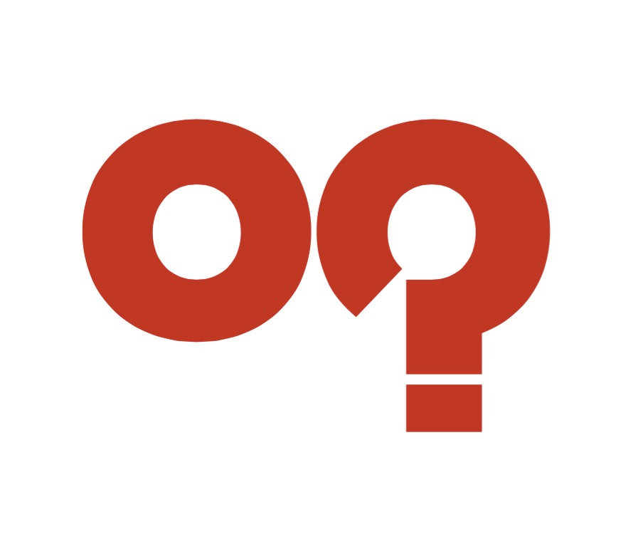
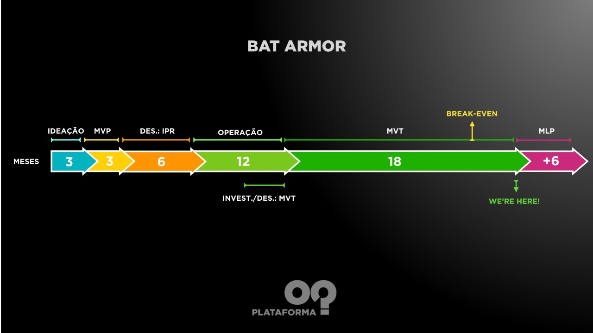
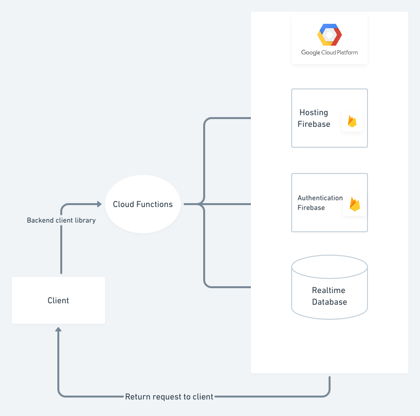
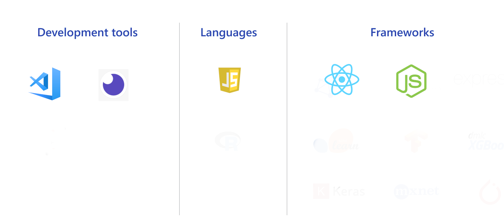

# OQ Digital

## Company

  
[https://oqdigital.com](https://oqdigital.com)  

UMA ALL-IN-ONE MARKETING PLATFORM QUE TRANSFORMA CLIENTES E EQUIPES DE VENDAS EM SOCIAL SELLERS/BRAND LOVERS DAS EMPRESAS NOS MEIOS DIGITAIS.

### Mulheres no Cap Tables
Fernanda Tavares (COO)  
[Linkedin](https://www.linkedin.com/in/fernandatavaresnascimento (Fernanda Tavares))  
Tel: (31) 99765-9419  
Email: fernanda.tavares@oqdigital.com

Alexia Kattah (CTO)  
[Linkedin](https://www.linkedin.com/in/alexiakattah (Alexia Kattah))  
Tel: (37) 99905-9194  
Email: alexia.kattah@oqdigital.com

## Product

### Bat Armor

 

Produto em Operação e buscando investimento para tração.

### Product Strategy

Somos uma all-in-one/unified platform de marketing e vendas que oferece uma solução completa para engajamento, monitoramento, comunicação e gerenciamento de equipes, motivação de vendedores e relacionamento e fidelização de clientes. Desenvolvemos, a partir de uma robusta plataforma White-label, uma versão tailor made e entregamos um enorme valor para nossos clientes ao cortar custos de aquisição, acelerar o ciclo de vendas, aumentar a produtividade das equipes e os resultados financeiros das empresas. Todo o processo de onboarding e implantação é modular e extremamente rápido; apesar de ser on-demand e 100% customizado para atender a realidade dos processos comerciais e as necessidades específicas de mercado de cada uma das empresas/clientes. A plataforma foi construída no padrão i18N para permitir a adaptação de idiomas, toda a coleta e tratamento de dados já está em conformidade com a LGPD, e grande parte do processo de implantação é automatizado e pré-modulado, permitindo uma entrada rápida e ganho de escala na velocidade que as vendas atingirem.

### Assessment

#### Modelo de Maturidade

#### Arquitetura
 

#### Ambiente tecnológico
 

#### Ambiente de produtividade

Lista com os fornecedores de:  
1.  Mensageria e compartilhamento: Discord, Slack;
2.  Meeting: Google Meet, Teams;
3.  Ferramentas de planejamento: Trello, Jira;
4.  Ferramentas Office: Google Drive;
5.  Compartilhamento de arquivos: Google Drive, Dropox;
6.  Compartilhamento de design: Figma, Adobe XD;

### Team Building

#### Time de tecnologia do produto
**Nome**: Alexia Karoline Xavier Lopes Kattah, 23 anos, alexia.kattah@oqdigital.com
**Cargo**: CTO, Engenheira de Computação e FullStack Developer com foco em desenvolvimento Web.
[https://www.linkedin.com/in/alexiakattah/](https://www.linkedin.com/in/alexiakattah/)
